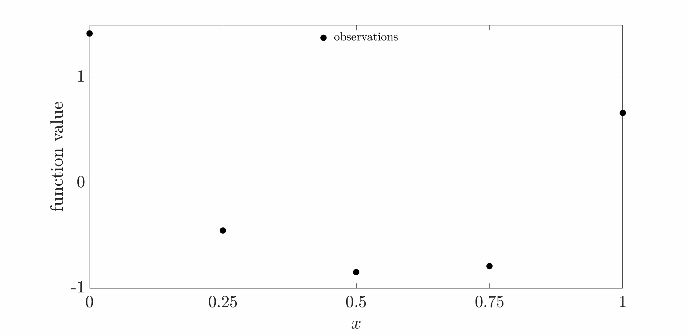

<div align="center">
  
</div>

**Sampling from Gaussian Processes**
> A Tutorial and Applications in Global Sensitivity Analysis and Optimization.

Gassian processes (GPs) naturally enable efficient sampling strategies that support informed decision-making under uncertainty.

We present the formulation and detailed implementation of two notable sampling methods -- random Fourier features and pathwise conditioning -- for generating posterior samples from GPs.

The code implements the random Fourier feature and pathwise conditioning methods.

## Dependency Files

- `ard_se_cov.m` — Computing exact automatic relevance determination squared exponential covariance functions.
- `chol2invchol.m` — Computing the inverse of a symmetric positive definite matrix using its Cholesky decomposition.
- `rff_ard_se_parameters.m` — Sampling random points in the frequency and phase domains for random Fourier features (RFFs).
- `rff_ard_se_posWeights_standard.m` — Sampling posterior weights using Sherman-Morrison-Woodbury (SMW) formula and standard sampling of the weights.
- `rff_ard_se_posWeights.m` — Sampling posterior weights using Sherman-Morrison-Woodbury (SMW) formula and an eigendecomposition of SMW matrix. This is faster than rff_ard_se_posWeights_standard.m.
- `rff_ard_se_features.m` — Evaluating RFFs at query points of interest.
- `rff_pc_se_paths.m` — Drawing posterior, prior, and update paths using pathwise conditioning (PC) wih RFF prior.

## Demo Files

- `demo_RFF_covfnc.m` — Computing approximate univariate SE covariance function for different number of RFFs.
- `demo_RFF_samplepaths.m` — Drawing several posterior samples using RFF method.
- `demo_PC_decoupling_concepts.m` — Drawing prior, update, and posterior samples using PC wih RFF prior.
- `demo_PC_samplepaths.m` — Drawing several posterior samples using PC wih RFF prior.

## Requirements

- MATLAB R2018a or later (older versions might work, but are not tested).
- Required Toolbox: Statistics and Machine Learning Toolbox

## Running the Experiments

1. Clone the repository:

    ```bash
    git clone https://github.com/UQUH/GPSampling_Edu.git
    cd GPSampling_Edu
    ```
2. Open MATLAB and set the repository folder as the working directory.

3. Run the demo script of interest.

## Citation

If you found this tutorial helpful, please cite the [following
paper](https://arxiv.org/abs/2507.14746):

```
@misc{do2025sampling,
      title={Sampling from Gaussian Processes: A Tutorial and Applications in Global Sensitivity Analysis and Optimization}, 
      author={Do, Bach and Ajenifuja, Nafeezat A and Adebiyi, Taiwo A and Zhang, Ruda},
      year={2025},
      eprint={2507.14746},
      archivePrefix={arXiv},
      url={https://arxiv.org/abs/2507.14746}, 
}
```

## The Team

The code is developed by the [Uncertainty Quantification Lab](https://uq.uh.edu) at the University of Houston.

The contributors are:
- Bach Do
- Nafeezat Ajenifuja
- Taiwo Adebiyi
- Ruda Zhang
